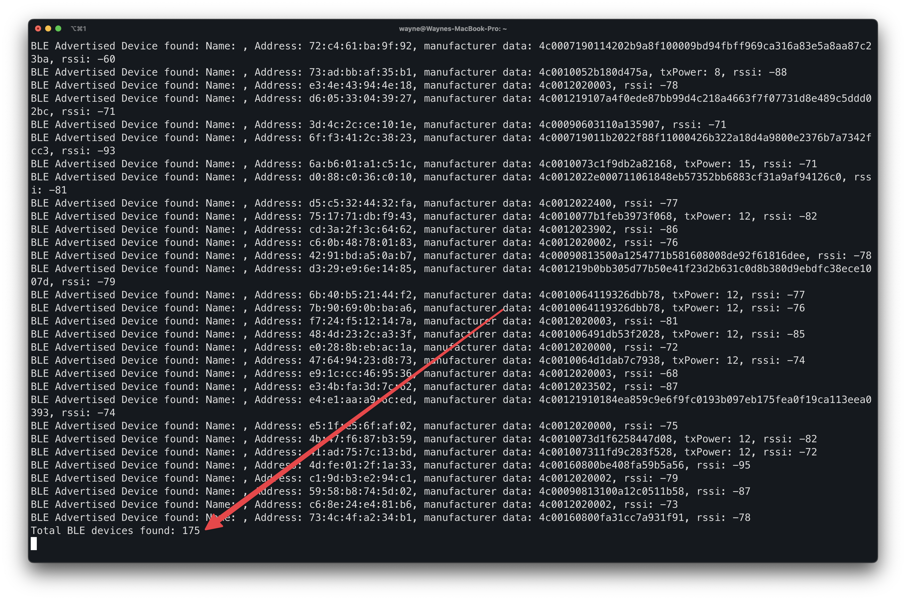
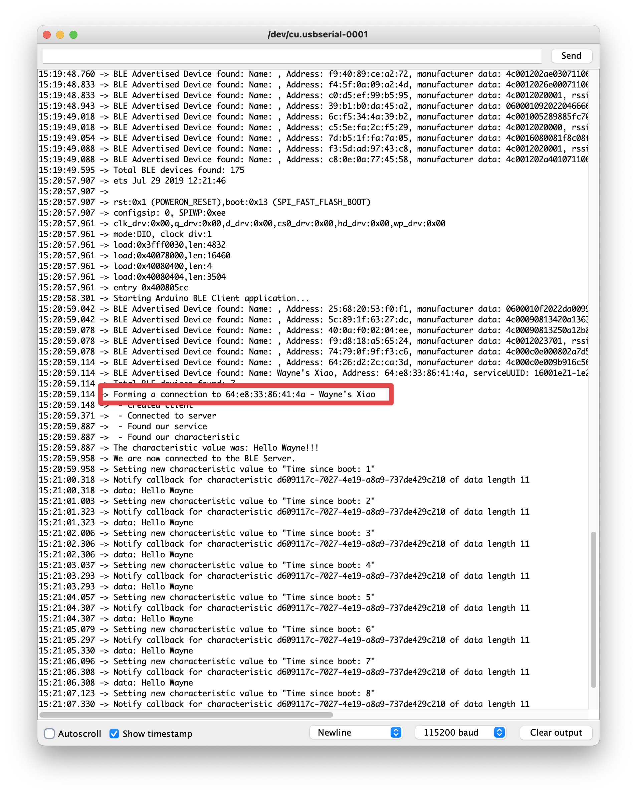
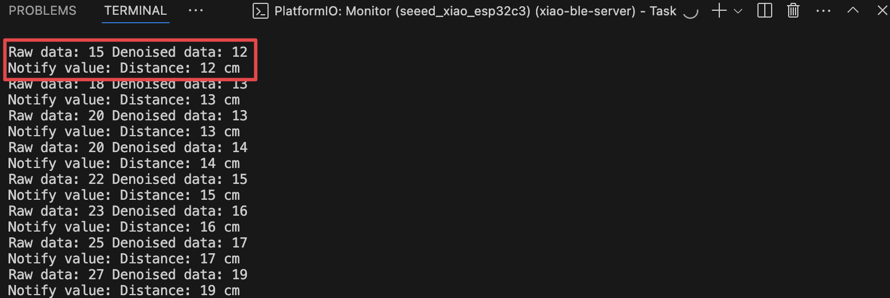
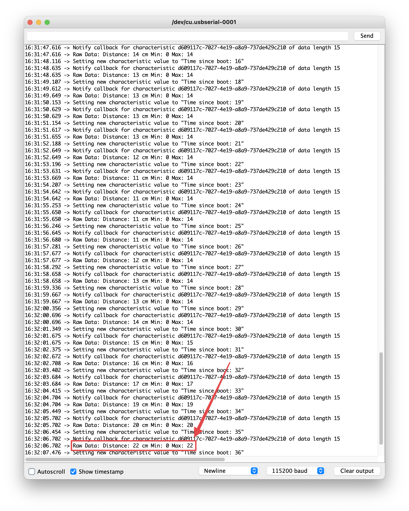

# Wireless Lab

Name: Wayne Tsai
NetID: wetsai

**GitHub Repository**: 

---

## Screenshots and Explanations

### 1. Bluetooth Devices Detected
- **Description**: This screenshot shows the number of Bluetooth devices detected using the MCU as `BLEScanner`.
- **Screenshot**: 

### 2. Successful Client Connection
- **Description**: This screenshot displays the serial monitor of the client device indicating a successful connection with the server device. The name of the server device is displayed.
- **Screenshot**: 

### 3. Server Device Data
- **Description**: This screenshot reflects the serial monitor of the server device, showing both raw and denoised sensor data.
- **Screenshot**: 

### 4. Transmitted Data from Server
- **Description**: This screenshot captures the serial monitor of the client device, displaying the current, maximum, and minimum data transmitted from the server device.
- **Screenshot**: 

**Note:**: I used ChatGPT to create the report markdown template.
