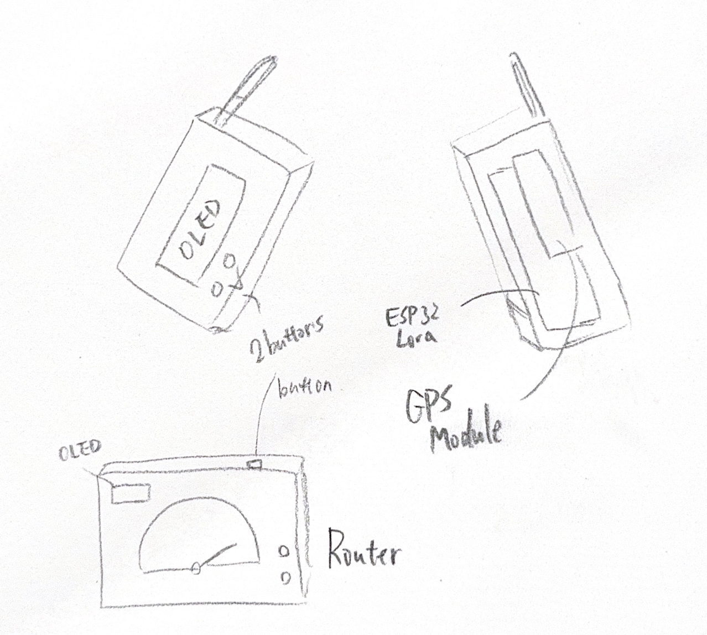
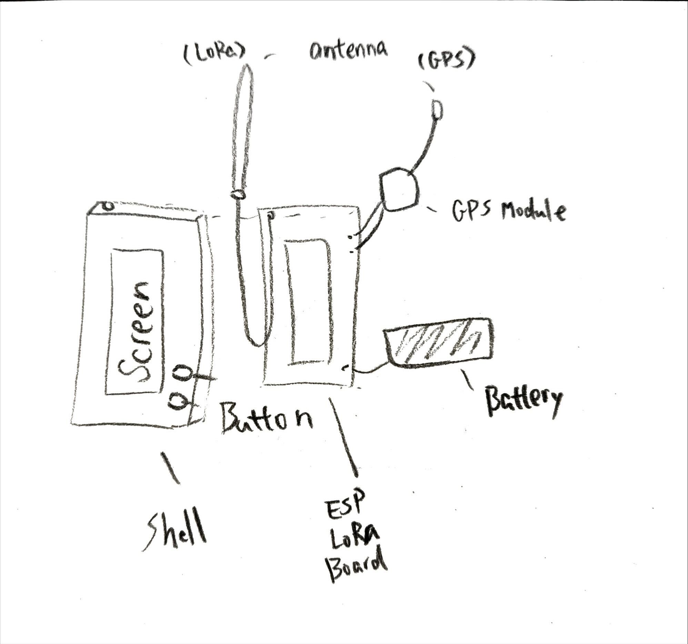
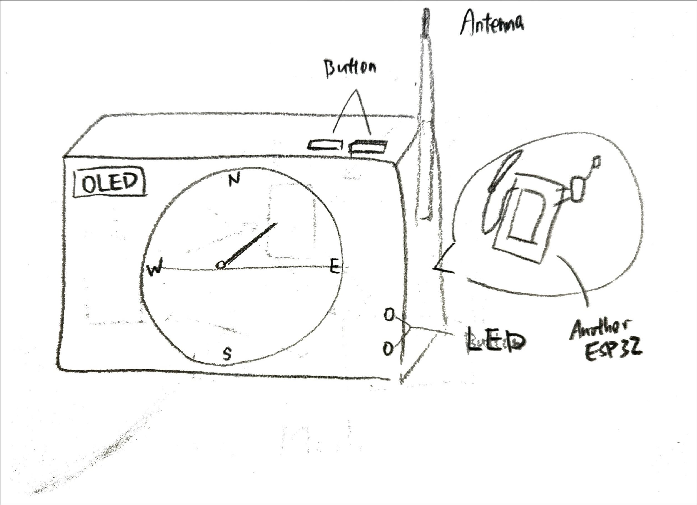
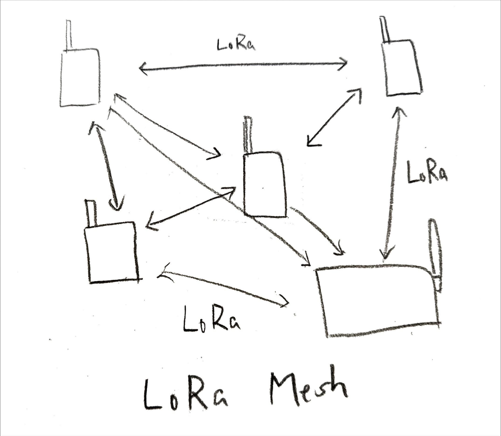
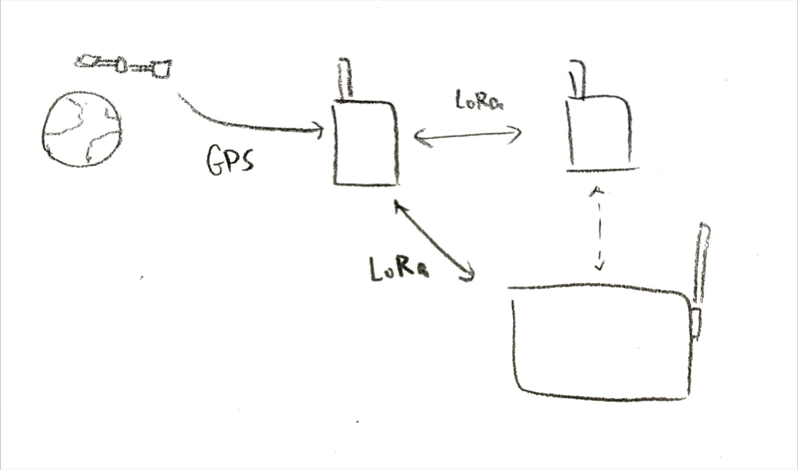

# PAGER (BEEPER)

## Overview
The PAGER (BEEPER) is a wireless telecommunications system based on Meshtastic LoRa mesh technology. It consists of individual beeper devices that can communicate with each other and a central dashboard display for monitoring and management. The system is designed for precise location tracking and efficient communication in remote or off-grid areas.

---

## Beeper Devices (Sensor Device)

### Description
The beeper devices form a mesh network, allowing them to communicate with each other and share location data. Each beeper includes:

- **Main Board ([WiFi LoRa 32 V3.2](datasheets/HTIT-WB32LA_V3.2.pdf))**
- **GPS Module** ([NEO-6M GPS ](datasheets/NEO-6.pdf)): Provides accurate location tracking
- **LED Indicator**: Shows connection and battery status
- **Small Display (Onboard OLED)**: Shows essential status information
- **Battery**: Long-lasting rechargeable power source

Each beeper can:
- Track and broadcast its location
- Receive locations from other beepers in range
- Send and receive emergency signals
- Display basic status information
- Operate in the mesh network independently

### Sketch

---

## Central Dashboard Display (Display Device)

### Description
The central dashboard display acts as a management hub for the entire beeper network. It provides comprehensive monitoring and control capabilities:

- **Gauge**: Show direction of the specified device.
- **LED**: Show system status.
- **Button**: Allows navigation through the menu.
- **OLED Display ([SSD1306](datasheets/SSD1306.pdf))**: Shows locations and status of all beepers in the network

Key Features:
- Real-time tracking of all beepers
- Network health monitoring
- Configuration management

### Sketch

---

## Communication and Workflow

### Communication Overview
The system utilizes Meshtastic LoRa mesh technology for robust, long-range wireless communication. Beepers can communicate directly with each other and relay information through the mesh network to reach the central dashboard.

### Workflow Diagram
The system workflow includes:

1. Beeper devices continuously track their location via GPS
2. Each beeper broadcasts its location and status to the mesh network
3. Beepers relay messages from other devices to extend network range
4. The central dashboard:
   - Collects data from all beepers
   - Displays real-time network status
   - Manages device configurations
   - Monitors for alerts or emergencies

---

